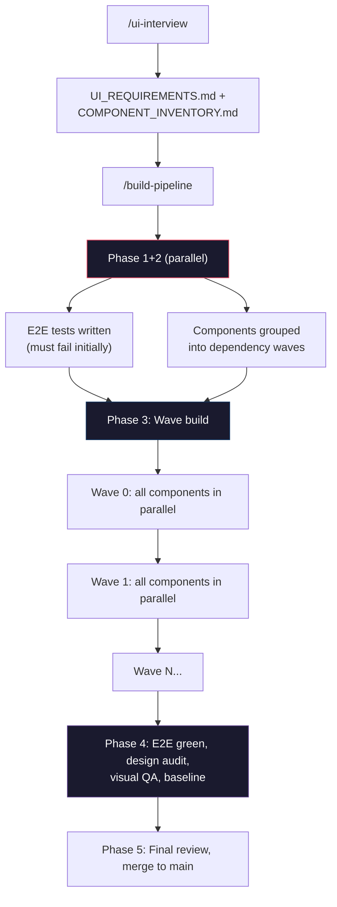
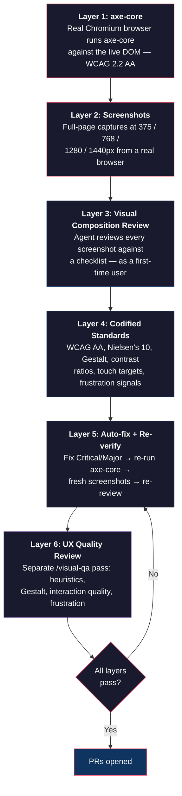

# Frontend Orchestration

A Claude Code plugin that builds your entire frontend from a conversation. You describe what you want, it interviews you, writes tests, builds components, audits everything, and opens PRs — all in dependency order, all TDD, all with your approval at every gate.

## What to expect

You start by talking. `/ui-interview` asks about your pages, components, data flows, user stories, and edge cases. Be specific — everything it builds comes from what you say here.

Then it builds. `/build-pipeline` resolves your components into dependency waves (leaf nodes first, composites after), writes failing E2E and unit tests, builds each component to make the tests pass, and never touches a test to make it green. Each wave gets code review, code simplification, design audit, and a11y audit before PRs are opened.

You approve at every gate: the build plan, each wave's audit results, visual baseline promotion, and merging. Nothing ships without you saying so.

## Quick start

From your workspace root (the directory you open Claude Code in):

```sh
# 1. Clone — the target directory name matters, don't change it
git clone https://github.com/Jakemo136/frontend-orchestrator.git \
  .claude/plugins/frontend-orchestration

# 2. Install deps, browsers, and register commands
.claude/plugins/frontend-orchestration/setup.sh
```

The plugin **must** live at `.claude/plugins/frontend-orchestration/` relative to your workspace root. Not `~/.claude/plugins/`, not `frontend-orchestrator/` — the exact path above.

The setup script installs dependencies, Playwright browsers, and creates a symlink at `.claude/commands/frontend-orchestration/` so Claude Code can discover the slash commands. (Claude Code only finds commands in `.claude/commands/`, not inside plugin directories.)

After install:
1. Restart Claude Code (quit and reopen, or start a new session)
2. Verify with `/session-start` — if it responds, you're good

Then create `orchestrator.config.yaml` in your project root — edit the values to match your project:

```yaml
project: my-app
scope:
  type: app
  target: null
branches:
  main: main
  feature: null
artifacts:
  requirements: docs/UI_REQUIREMENTS.md
  inventory: docs/COMPONENT_INVENTORY.md
  build_plan: docs/BUILD_PLAN.md
  build_status: docs/BUILD_STATUS.md
  design_audit: docs/DESIGN_AUDIT.md
  visual_qa: docs/VISUAL_QA.md
commands:
  test_client: npm test
  test_server: cd server && npm test
  test_e2e: npx playwright test
  build_client: npm run build
  dev_server: npm run dev
  typecheck: npx tsc --noEmit
ci:
  required_on_main: [client, e2e]
  required_on_feature: [client]
  informational_on_feature: [e2e]
```

## Commands

| Command | What it does |
|---|---|
| `/session-start` | Reorient at the start of a session |
| `/ui-interview` | Requirements interview — produces UI_REQUIREMENTS.md and COMPONENT_INVENTORY.md |
| `/build-component [Name]` | Build one component TDD-style |
| `/build-page [Page]` | Build all components for a page, parallelized by dependency wave |
| `/build-pipeline` | Full autonomous build: E2E tests, dependency waves, audits, PRs |
| `/review-requirements` | Summarize build state, suggest next step |
| `/design-audit [route?]` | A11y + design audit at all breakpoints, auto-fix critical issues |
| `/visual-qa [route?]` | UX quality review — Nielsen's heuristics, Gestalt, frustration signals |
| `/set-baseline [route?]` | Promote screenshots to visual regression baseline |

## How it works



Each phase gates on the previous. The pipeline can resume from any checkpoint.

## Parallelization

The orchestrator dispatches as many subagents as possible in parallel. Within each wave, every component builds simultaneously — not one at a time. Audits, screenshots, and reviews also parallelize per route. This prevents any single agent from bloating its context trying to solo-hero a multi-component step.

Specifically:
- **E2E test writing + dependency resolution** run in parallel (Phase 1+2)
- **All components in a wave** build in parallel via separate subagents
- **Design audit** dispatches static analysis, axe-core, and screenshot capture in parallel
- **Visual QA** dispatches one reviewer per route in parallel
- **E2E test files** are written in parallel, one subagent per user flow

## What's inside

```
frontend-orchestration/
  commands/       9 plugin commands (the slash commands above)
  subagents/      8 specialized agents (component-builder, e2e-writer, etc.)
  runner/         DAG executor — state machine, evidence pipeline, step implementations
  mcp/            2 MCP servers (a11y-scanner, screenshot-review)
  standards/      Design, a11y, and UX quality checklists
  setup/          Recommended hooks and install guide
```

## Why the audits are trustworthy

The design audit and a11y steps aren't an LLM squinting at code and guessing. They're layered: automated tooling produces hard data, then agents review what the tools can't catch.



**Layer 1: axe-core (machine, not vibes).** The a11y-scanner MCP server launches a real Chromium browser, navigates to your running app, and runs [axe-core](https://github.com/dequelabs/axe-core) against the live DOM. axe-core is the industry standard — it powers the accessibility checks in Chrome DevTools, Lighthouse, and most enterprise a11y workflows. When it reports a WCAG 2.2 AA violation, that's a real DOM element failing a real WCAG success criterion, not an inference.

**Layer 2: Screenshots at four breakpoints (evidence, not assumptions).** The screenshot-review MCP server captures full-page screenshots at 375px, 768px, 1280px, and 1440px. These are real renders from a real browser — layout issues, overflow, clipping, and responsive breakage show up as visual artifacts, not as code-pattern guesses.

**Layer 3: Visual composition review (structured, not freeform).** After the automated tools run, the design-auditor agent reviews every screenshot against a specific checklist: duplicate elements, visual hierarchy, alignment, navigation consistency, empty states. It's looking at actual screenshots, not source code, and it's told to evaluate like a first-time user — flag anything confusing, not check boxes.

**Layer 4: Codified standards.** The audit checklists in `standards/design-and-a11y.md` and `standards/ux-quality.md` are concrete and enumerated — WCAG 2.2 AA conformance targets, Nielsen's 10 heuristics, Gestalt principles, interactive state requirements (hover/focus/active/disabled), contrast ratios (4.5:1 text, 3:1 non-text UI), touch targets (44x44px), and 10 specific frustration signals (dead clicks, mystery meat navigation, data loss, silent failures, etc.). The agents audit against these standards, not against their own opinions.

**Layer 5: Auto-fix with re-verification.** When the audit finds Critical or Major issues, it fixes them and re-runs the entire audit — axe-core scan, fresh screenshots, visual review. The fix isn't done until the re-scan confirms resolution. Minor issues are flagged for human review, never auto-fixed.

**Layer 6: UX quality review (`/visual-qa`).** A separate pass with a different lens. The design audit catches "is this built correctly?" The UX quality review asks "does this feel right to use?" It evaluates against Nielsen's 10 usability heuristics (system status visibility, error prevention, recognition over recall, etc.), Gestalt principles (proximity, similarity, continuity), interaction quality (44x44px touch targets, affordances, form UX, perceived performance), and 10 specific frustration signals — dead clicks, mystery meat navigation, data loss risk, forced detours, ambiguous actions, silent failures, jarring transitions, cognitive overload, inconsistent behavior, and broken expectations. Run it after `/design-audit` passes — a11y compliance first, then UX.

The confidence comes from the stack: machine-verified a11y, real browser renders, structured visual review, codified standards, heuristic UX evaluation, and re-verification after fixes. No single layer is sufficient alone, but together they catch categories of issues that code review misses.

## Evidence pipeline

When E2E tests run, the orchestrator collects structured failure evidence:

- Playwright traces (`.zip` — open with `npx playwright show-trace`)
- Failure screenshots
- Machine-readable `evidence-manifest.json` per test run

Evidence is persisted to `.orchestrator/evidence/` and referenced in step results. See `setup/` for CI artifact upload patterns.

## Requirements

- Node.js 20+
- Claude Code
